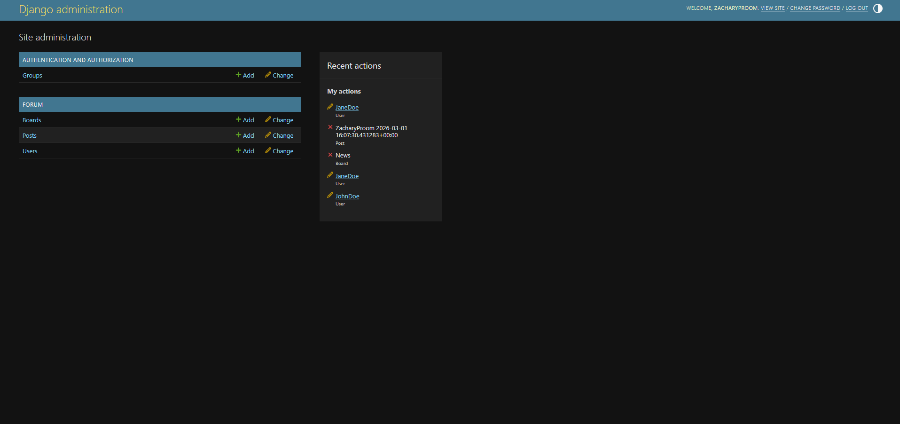
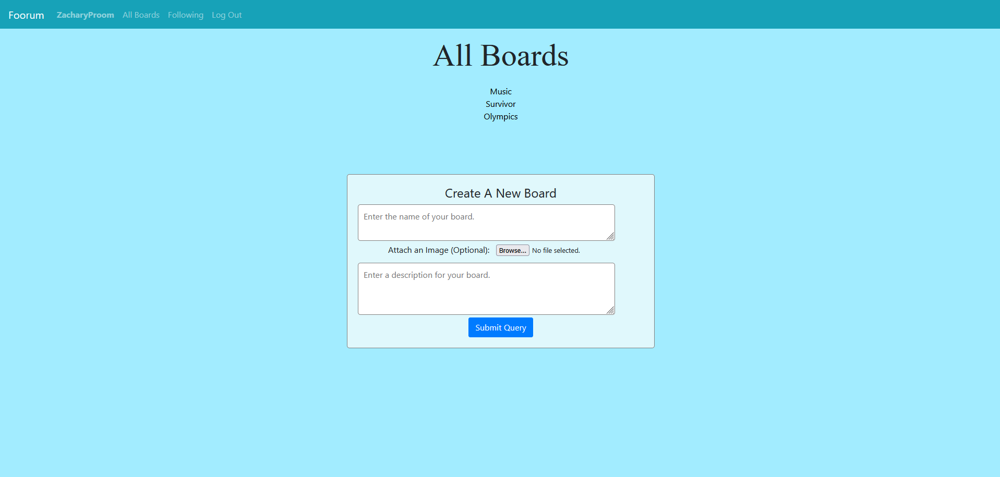
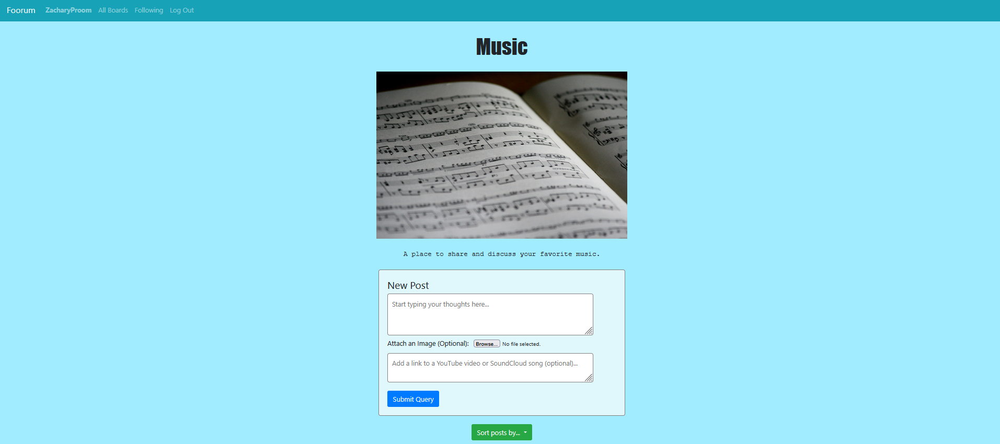
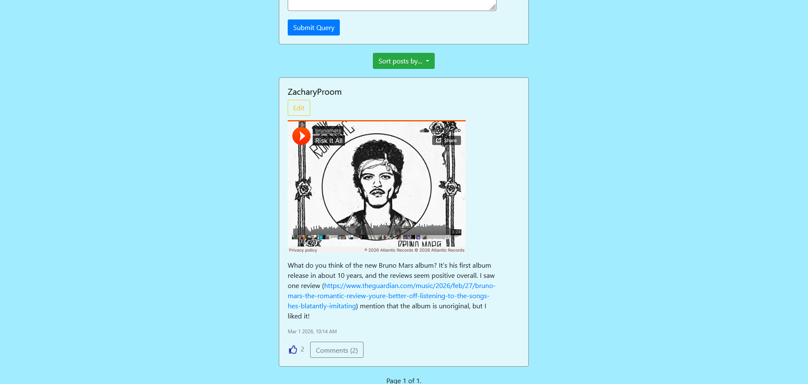
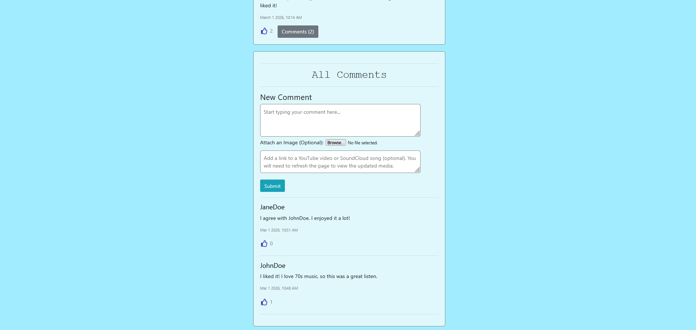

# Foorum

## Overview

Foorum is a simple web forum that enables users to submit posts on discussion boards with distinct topics. Signed in users are able to create and edit posts on each board and can like and comment on other users' posts. Users also have the ability to follow other users and can view those users' posts in a separate page. If given permission by an administrator, users may create new discussion boards. The app utilizes Python (Django framework) on the back-end to enable users to create new posts and boards, sort posts, and follow and unfollow other users. On the front-end, JavaScript lets users create new comments and edit and like posts and comments via the app's API. To embed media, the app uses the django-embed-video app. The app runs locally in a Docker container.

## How to run the app

The app is packaged as a Docker container so it can be run locally. Docker is the only prerequisite.

From the root folder of the repository, run the following commands:

```
docker build -t foorum .
```

Once the image is built, start the container with:

```
docker run -p 8000:8000 foorum
```

In addition to installing all the project dependencies, the Dockerfile creates the app database schema based on the code in `forum/models.py`.

The app will be available at: http://127.0.0.1:8000.

### Adding content to the site

You will notice that there are no boards and no other users.

Create one or more superusers who can create, edit, and delete any of the models in Foorum by running:

1. If the container is not running: `docker start <container-name-or-id>` (you can check the container information by running `docker ps --all`) 
2. `docker exec -it <container-name-or-id> python3 manage.py createsuperuser`

To use the admin app, go to the URL http://127.0.0.1:8000/admin/ and sign in with your superuser's credentials. The admin app offers a quick way to populate Foorum with content. While signed in as the superuser, create boards by submitting forms on the All Boards page.

You can also create regular users by signing out and clicking the Register link at the top of the page. The admin user will need to activate regular user accounts in the admin app before they can log in and post. In the admin app, click "Users", then click on the appropriate user in the list. Ensure the box labelled "Active" is checked.

To give regular users the ability to create new boards as an admin, go to the admin app and click "Users". Click on the appropriate user in the list and next to "User permissions" control click "forum|board|Can add board".

Below is a screenshot of the admin interface.



## Technologies Used

- Backend: Python, Django
- Frontend: HTML/CSS, Bootstrap, vanilla JavaScript
- Database: SQLite for development (can be switched to PostgreSQL)
- Deployment/Dev: Docker, Gunicorn (production), Django development server

## Models

Foorum includes the following models:
- User
- Post
- Board

The **User** model stores information about each user, including the users they follow, their followers, and the posts and comments they have liked. 

The **Post** model stores information about each post on a discussion board. This includes the post's author, the post's associated discussion board, the post's content, an optional image and video, the post's like count, and the post's timestamp. The Post model is used for both top-level posts and comments on posts. 

The **Board** model stores a discussion board's name and description.

## Templates

Foorum is a multipage application that comprises six HTML files, listed below.
- layout.html (layout inherited by each template)
- login.html (login page)
- register.html (new user registration page) 
- index.html
- posts.html
- comments.html

**index.html** is the page all users land on when opening Foorum. It lists all of the existing discussion boards as links. Users who have been granted permission by an administrator also see a form for creating new discussion boards below the list of boards.

The page should look something like this:



**posts.html** is a page that is used to present listed posts. In particular, this page is displayed when: (1) any user clicks on a link to a discussion board; (2) any user clicks on a username in a post or comment; or (3) a signed in user clicks the "Following" link at the top of the screen (users who are not signed in cannot see the link to this page). The content of the page changes depending on which of the three links is opened. In a discussion board (1), users can see the name and description of the board and a sortable list of posts associated with the board. Signed in users also see a form to create new posts. A profile page (2) shows the user's follower count, following count (number of users they follow), and all of the user's posts in reverse chronological order. Signed in users also have the ability to follow and unfollow the user. The following page (3) displays all posts authored by users followed by the signed in user.

Below is an example of a discussion board with one post.




**comments.html** is the page all users see after clicking on the Comments button under a post. The page displays the original post and all of the comments associated with the post in reverse chronological order. Signed in users also see a form to create new comments.

Here's an example of the comments under a post in a music board:



## Static Files

The **static** directory contains a JavaScript file and a CSS file.

- script.js
- styles.css

**script.js** creates a dynamic user interface for the app. In particular, it lets users create new comments, edit posts and comments, and like posts and comments using the app's API. To create comments and edit comments and top-level posts, the script uses Ajax requests. The app uses JavaScript from Bootstrap and Popper to create a dropdown sort button on each board. Since video embedding in this app relies on template tags, users must reload the page to view updates to embdedded media.

**styles.css** styles the app's templates and helps make the app mobile-responsive. The app uses Bootstrap and Font Awesome for additional styling (e.g. buttons and the like icon).

The remaining static files are the image files in board headers and posts. These are stored in a separate media directory.

## Future Work

Potential extensions of the project include:

- Add the ability to reset forgotten passwords 
- Improve the styling and overall look of the app
- Deploy the app to a hosted environment
- Add more tests to ensure the app is working properly
